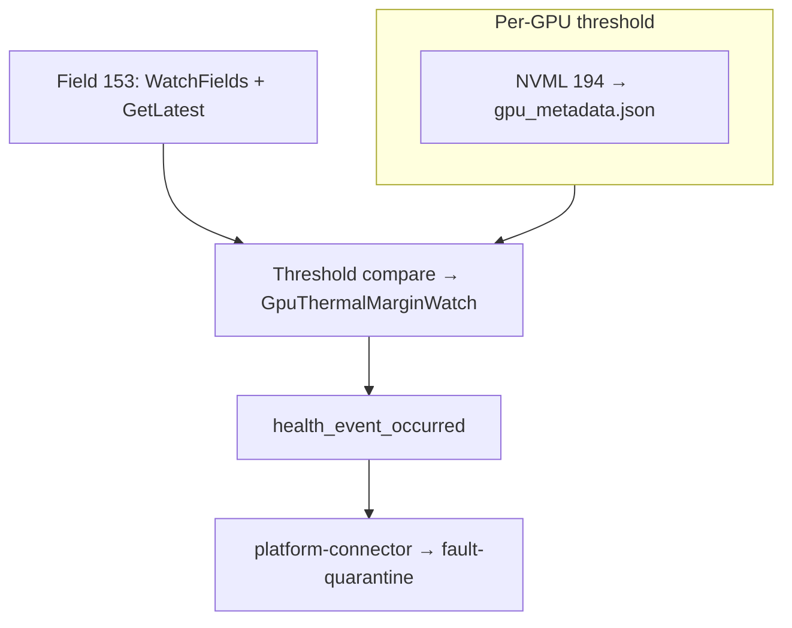

# ADR-042: GPU Health Monitor — GPU Thermal Margin (DCGM Field 153)

## Context

NVSentinel currently uses the DCGM health watch `DCGM_HEALTH_WATCH_THERMAL` to monitor for thermal throttling, which internally monitors the `DCGM_FI_DEV_THERMAL_VIOLATION` counter using the below DCGM logic to decide whether thermal throttling is happening.

- DCGM samples field 241 on a fixed interval.
- On each `health.Check()`, it compares the latest TVIOL sample to the earliest sample in the lookback window.
- If TVIOL increased, DCGM emits a thermal warning for that GPU.

The problem with the above logic is that there is no clarity on how far GPU temperatures crossed the thermal margin, whether the cause is workload or hardware. It does not provide quantifiable data on the severity of the issue.

Hence, as part of this ADR, the idea is to use `DCGM_FI_DEV_GPU_TEMP_LIMIT` as a signed thermal-margin signal to decide whether thermal headroom has crossed the hardware slowdown boundary.

**Goal.** Monitor GPU thermal margin via DCGM field 153 (`DCGM_FI_DEV_GPU_TEMP_LIMIT`), report `GpuThermalMarginWatch` as a non-fatal per-GPU observation, and use a separate `GpuThermalQualificationRequired` event to run controlled qualification. A passing GPU is snoozed from further qualification for seven days.

## Definitions

### T.Limit (DCGM field 153)

Per [NVIDIA nvidia-smi temperature documentation](https://docs.nvidia.com/deploy/nvidia-smi/index.html#temperature), **GPU T.Limit Temp** is the thermal margin to maximum operating temperature; **GPU Slowdown / Shutdown T.Limit** are the offsets at which HW protection engages.

| Margin              | Meaning                                                                  |
| ------------------- | ------------------------------------------------------------------------ |
| `> 0`               | Headroom to max-operating / SW optimization (e.g. `23` = 23 °C margin)   |
| `≤ 0`               | At or past max-operating; GPU may optimize clocks for thermal conditions |
| `≤ slowdown_offset` | At or past **Slowdown T.Limit** — HW may clamp clocks                    |
| `≤ shutdown_offset` | At or past **Shutdown T.Limit** — emergency shutdown risk                |

### What is GpuThermalMarginWatch

Under load, the GPU reduces clocks to stay within thermal limits. SW thermal management can cap clocks first; if temperature continues to rise, HW protection engages and first slows down the GPU. If that still cannot control the temperature, HW shutdown is triggered to protect the GPU.

This ADR targets how NVSentinel should react when a GPU's signed thermal margin (**T.Limit**, field 153) crosses the GPU **hardware slowdown** line. Warm GPUs under load may throttle without crossing that margin; conversely, margin below the HW offset is the monitored boundary.

`GpuThermalMarginWatch` records the live condition. It does not itself decide that the GPU needs repair. `GpuThermalQualificationRequired` represents the separate obligation to drain the node and qualify that GPU under a controlled workload.

### Problem

**1. The HW slowdown offset differs by GPU SKU and is not exposed as a DCGM field.**

`GpuThermalMarginWatch` needs to compare the live T.Limit margin against the GPU's HW slowdown offset. That offset is not the same for every SKU, so hardcoding one value (for example, `−2 °C`) would be wrong:

| GPU SKU                       | T.Limit model | Slowdown offset      |
| ----------------------------- | ------------- | -------------------- |
| H100, GB200, GB300, L40, L40S | relative      | **−2**               |
| B200                          | relative      | **−3**               |
| A100                          | absolute      | **N/A** (no T.Limit) |

DCGM field 153 (`DCGM_FI_DEV_GPU_TEMP_LIMIT`) gives the live signed margin, but DCGM does not expose the per-SKU slowdown offset constant needed for the comparison.

**Solution:** read the slowdown offset once per GPU in `metadata-collector` using NVML field 194 (`NVML_FI_DEV_TEMPERATURE_SLOWDOWN_TLIMIT`) and publish it in `gpu_metadata.json`. `gpu-health-monitor` then reads that metadata during its normal poll loop and skips GPUs where the offset is unsupported or missing.

**2. A margin crossing does not by itself establish a hardware fault.**

A workload can cause the margin to cross briefly and later recover. The node must be qualified under a controlled GPU profiling workload before deciding that the GPU requires repair. Once that qualification passes without a GTLIMIT crossing, repeating the same disruptive workflow for that GPU on every event is unnecessary.

## Decision

Add an **in-monitor field watch** on field 153 in `DCGMWatcher`, compare each poll against the **per-GPU HW slowdown** threshold, and emit health events through the existing health-event pipeline.

- `GpuThermalMarginWatch` is **non-fatal** when margin `<` slowdown offset (for example, `−3` on H100 with threshold `−2`). It clears when margin is at or above the slowdown offset.
- When a GPU violates the threshold and has no active snooze or pending qualification, `gpu-health-monitor` emits a fatal, per-GPU `GpuThermalQualificationRequired` event.
- `GpuThermalQualificationRequired` does not clear merely because the live margin recovers. It clears only after the matching GPU passes controlled qualification.
- A successful qualification snoozes `GpuThermalQualificationRequired` for that GPU UUID for `168h` from the qualification completion time.
- The snooze does not suppress field monitoring or `GpuThermalMarginWatch`; it suppresses only a new qualification request for that GPU.

Note that `DCGM_HEALTH_WATCH_THERMAL` / `GpuThermalWatch` remains unchanged and complementary to `GpuThermalMarginWatch`.

## Implementation



Runtime watches field 153 in `DCGMWatcher`; thresholds come from `gpu_metadata.json`.

### Threshold source: NVML via `metadata-collector`

`gpu-health-monitor` has DCGM only (no NVML). `metadata-collector` already `nvml.Init()`s and writes `gpu_metadata.json`. `go-nvml v0.13.2-0` provides `Device.GetFieldValues` and constant 194.

1. **`metadata-collector/pkg/nvml/wrapper.go`** — in `GetGPUInfo`, query field 194 with `Device.GetFieldValues`, require `NvmlReturn == SUCCESS`, require `VALUE_TYPE_SIGNED_INT`, decode the signed little-endian int, and set pointer nil when unsupported (A100, old drivers).
2. **`data-models/pkg/model` `GPUInfo`** — add `SlowdownTLimitC *int` (`omitempty`; absent ≠ zero — `0` is a valid margin).
3. **`gpu-health-monitor/metadata/reader.py`** — `get_slowdown_tlimit_c`; `None` means the GPU is not eligible for `GpuThermalMarginWatch` on that poll. The reader lazy-loads metadata, and missing thresholds are observable via `gpu_temp_limit_slowdown_threshold_missing_total`.
4. **`DCGMWatcher` poll loop** — on each `PollIntervalSeconds` cycle: `health.Check()`, then field-153 read/evaluate, then one `health_event_occurred` for all emitted watches. `GpuThermalMarginWatch` is merged only when at least one GPU has both threshold metadata and a non-blank field-153 sample. Its `HealthDetails.entity_ids` scopes healthy/unhealthy events to evaluated GPUs only. GPUs with missing threshold or blank field 153 are skipped for comparison. `platform_connector` deduplicates via `entity_cache`. If `GetLatest` fails, skip the watch for that cycle and increment the metric.

### Field watch and evaluator (`DCGMWatcher`)

When enabled, after `DCGM_HEALTH_WATCH_ALL`:

- Register field 153 on the same DCGM group; `WatchFields` at poll interval.
- Each poll cycle: `health.Check()` → read field 153 via `GetLatest` → threshold compare → merge `GpuThermalMarginWatch` for evaluated GPUs → evaluate qualification snooze/pending state → one `health_event_occurred` call.

```text
Threshold metadata absent → emit nothing (GPU not watched)
Field 153 N/A / blank → skip evaluation for that GPU
margin < slowdown_threshold → non-fatal GpuThermalMarginWatch FAIL
margin ≥ slowdown_threshold → GpuThermalMarginWatch PASS for that evaluated GPU
```

The threshold comparison remains strict: equality with `slowdown_threshold` is healthy.

**`platform_connector.py`** — guard in `_convert_dcgm_watch_name_to_check_name` so synthetic keys resolve to `GpuThermalMarginWatch`, and respect `HealthDetails.entity_ids` so skipped GPUs are not cleared as healthy.

**`dcgmerrorsmapping.csv` (mandatory):**

```csv
GPU_TEMP_HW_SLOWDOWN_VIOLATION,NONE
```

**Metrics:** `gpu-health-monitor` only exports gap signals for this watch: `gpu_temp_limit_margin_blank_total` when DCGM field 153 is missing/blank and `gpu_temp_limit_slowdown_threshold_missing_total` when the NVML-derived slowdown offset is missing from metadata. `GetLatest` failures reuse the existing `dcgm_api_failures{error_name="dcgm_field_153_get_latest"}` counter.

### Qualification and seven-day snooze

Qualification state is tracked independently for each GPU UUID. GPU index alone is not sufficient because an index can refer to a replacement GPU after hardware service.

#### `GpuThermalQualificationRequired` HealthEvent contract

For a violating GPU without a valid snooze or pending request, GHM emits one unhealthy HealthEvent with the following fields:

| HealthEvent field | Value |
| --- | --- |
| `version` | `1` |
| `agent` | `gpu-health-monitor` |
| `componentClass` | `GPU` |
| `checkName` | `GpuThermalQualificationRequired` |
| `isFatal` | `true`, so the normal quarantine and drain pipeline runs |
| `isHealthy` | `false` |
| `message` | Identifies the GPU and records the observed T.Limit margin and its slowdown threshold |
| `recommendedAction` | `CUSTOM` |
| `customRecommendedAction` | `GPU_THERMAL_QUALIFICATION` |
| `errorCode` | `GPU_THERMAL_QUALIFICATION_REQUIRED` |
| `entitiesImpacted` | Exactly one `GPU` index, its `PCI` address, and its `GPU_UUID`; all three are required |
| `metadata` | `qualification_id`, `trigger_margin_c`, `slowdown_tlimit_c`, `dcgm_field_id=153`, and `chassis_serial` when available |
| `generatedTimestamp` | Time at which GHM created the qualification request |
| `nodeName` | Node containing the affected GPU |
| `processingStrategy` | GHM's configured strategy; it must be `EXECUTE_REMEDIATION` for the qualification Job to run. `STORE_ONLY` records the event but performs no cordon, drain, or qualification |
| `quarantineOverrides`, `drainOverrides` | Unset; normal policy applies |

`qualification_id` is generated by GHM and is the workflow correlation key; it is distinct from the datastore's HealthEvent identity. The GPU entities are used for identity and result matching, but `GPU_THERMAL_QUALIFICATION` is configured as a node-scoped remediation action with no `impactedEntityScope`, because the node must be fully drained before applying the qualification load.

On PASS, GHM first persists the per-GPU snooze and then immediately emits the healthy clear with the same `nodeName`, `checkName`, and exact set of `entitiesImpacted`. The clear has `isHealthy=true`, `isFatal=false`, `recommendedAction=NONE`, no error code, and metadata containing the matching `qualification_id`, `qualification_result=PASS`, `qualification_completion_time`, and `snooze_until`.

#### Automated qualification Job

The existing remediation pipeline then:

1. cordons and fully drains the node;
2. routes `CUSTOM:GPU_THERMAL_QUALIFICATION` through fault remediation to Janitor;
3. Janitor creates at most one active qualification Job per node, pins it to the drained node, and monitors the Job lifecycle; and
4. the Job writes its raw artifacts and machine-readable per-GPU result to a dedicated shared node-local path under `/var/lib/nvsentinel`, which GHM reads without watching a Kubernetes CR.

The Job uses a dedicated qualification image built `FROM nvcr.io/nvidia/cloud-native/dcgm:${DCGM_VERSION}`. The selected image must match the DCGM major supported on the node and must contain `dcgmproftester`, `dcgmi`, `nvidia-smi`, and the qualification wrapper. This avoids executing commands inside the existing GPU Operator DCGM pod and makes the command, wrapper, and result schema versioned as part of NVSentinel.

The Job is configured with `restartPolicy: Never`, no automatic Job retry, a deadline longer than the 900-second profiler duration, the quarantine toleration, and enough NVIDIA GPU resources to expose all GPUs on the node. It runs only after the node is fully drained. A retry is an explicit new controller decision after an `INCONCLUSIVE` result; Kubernetes must not silently repeat a disruptive thermal workload.

One container in the Job performs the following ordered workflow, replacing the separate operator shells in the runbook:

1. **Validate identity and inputs.** Read the expected GPU index, PCI address, GPU UUID, `qualification_id`, and `slowdown_tlimit_c`; verify that the current GPU UUID still matches the request; record the DCGM image, driver, CUDA, `dcgmi`, `nvidia-smi`, and profiler versions; and verify that no unexpected GPU compute process remains after the drain. Janitor may delete a stale qualification Job that it owns, but the runner must not blindly kill an unknown process. A missing threshold, identity mismatch, missing profiler binary, unexpected GPU process, or another active qualification on the node produces `INCONCLUSIVE`.
2. **Capture the before snapshot.** Record `dcgmi dmon -e 153,150,140 -c 1` and `nvidia-smi -q -d TEMPERATURE` before applying load.
3. **Start one-second telemetry collection.** In the background, capture every GPU's timestamp, index, UUID, PCI address, serial, name, `temperature.gpu.tlimit`, `temperature.gpu`, `temperature.memory`, `power.draw`, `clocks.current.sm`, `clocks_throttle_reasons.active`, and `utilization.gpu`. Also retain DCGM field 153 samples so the decision uses the same GTLIMIT signal as `GpuThermalMarginWatch`.

   ```bash
   nvidia-smi \
     --query-gpu=timestamp,index,uuid,pci.bus_id,serial,name,temperature.gpu.tlimit,temperature.gpu,temperature.memory,power.draw,clocks.current.sm,clocks_throttle_reasons.active,utilization.gpu \
     --format=csv --loop=1 --filename="$ARTIFACT_DIR/telemetry.csv"
   ```

4. **Apply the qualification load.** In the foreground, run the versioned profiler binary supplied by the image, for example:

   ```bash
   "$DCGM_PROFTESTER" --no-dcgm-validation --max-processes 0 -t 1004 -d 900
   ```

   Test 1004 generates sustained Tensor-Core GEMM load for 15 minutes. `--max-processes 0` exercises all visible GPUs in parallel so the target GPU can be compared with its peers; the qualification decision and snooze remain scoped only to the GPU UUID named by the HealthEvent.
5. **Capture the after snapshot and stop sampling.** Always attempt the final `dcgmi` and `nvidia-smi` snapshots, including when the profiler fails or the Job receives a termination signal.
6. **Persist complete evidence.** Store profiler stdout/stderr, the full one-second telemetry CSV, before/after snapshots, and an atomically written `result.json` under `/var/lib/nvsentinel/thermal-qualification/<qualification_id>/`.

The result contains the request identity, image and tool versions, start/completion timestamps, exact profiler command and exit code, actual duration, sample interval/count, whether the target GPU was exercised, whether telemetry was complete, and per-GPU summaries including minimum GTLIMIT, maximum GPU and memory temperatures, maximum power, SM clocks, utilization, and observed throttle reasons. Raw samples remain the source of truth; summary values make the result inexpensive for GHM to evaluate and for operators to review later.

```mermaid
sequenceDiagram
    participant GHM as gpu-health-monitor
    participant FQ as fault-quarantine / node-drainer
    participant FR as fault-remediation
    participant J as Janitor
    participant JOB as qualification Job
    participant FS as node-local result path

    GHM->>FQ: unhealthy GpuThermalQualificationRequired
    FQ->>FQ: cordon and fully drain node
    FQ->>FR: drained HealthEvent
    FR->>J: CUSTOM:GPU_THERMAL_QUALIFICATION
    J->>JOB: create one node-pinned Job
    par controlled load
        JOB->>JOB: dcgmproftester test 1004 for 900s
    and parallel telemetry
        JOB->>JOB: sample GTLIMIT, temperatures, power, clocks, throttle reasons, utilization
    end
    JOB->>FS: atomically write raw artifacts and result.json
    GHM->>FS: read and validate qualification_id + GPU_UUID
    alt PASS
        GHM->>GHM: persist GPU snooze for 168h
        GHM->>FQ: healthy GpuThermalQualificationRequired
    else REPAIR_REQUIRED
        GHM->>FQ: fatal GpuThermalRepairRequired, REPLACE_VM
        FQ->>FR: already-drained repair HealthEvent
        FR->>J: create TerminateNode
    else INCONCLUSIVE
        GHM->>GHM: retain pending qualification; no clear or replacement
    end
```

`dcgmproftester --no-dcgm-validation` is a load generator, so process exit alone is not PASS. GHM uses the profiler result and sampled GTLIMIT values to decide:

| Outcome | Criteria | Action |
| --- | --- | --- |
| `PASS` | Profiler completes successfully, the target GPU is exercised, telemetry is complete, and every GTLIMIT sample is `>= slowdown_tlimit_c` | Save the seven-day snooze, immediately emit healthy `GpuThermalQualificationRequired`, and release the node |
| `REPAIR_REQUIRED` | The profiler run is valid and any GTLIMIT sample is `< slowdown_tlimit_c` | Keep the qualification event unhealthy, emit fatal `GpuThermalRepairRequired` with error code `GPU_THERMAL_QUALIFICATION_FAILED` and recommended action `REPLACE_VM`, and do not snooze |
| `INCONCLUSIVE` | Profiler failure, missing target load, identity mismatch, or incomplete telemetry | Keep the node quarantined for retry or investigation; do not snooze or make a repair decision |

`GpuThermalQualificationRequired` retains the custom action `GPU_THERMAL_QUALIFICATION`; it must not use `REPLACE_VM`. GHM emits `GpuThermalRepairRequired` only after accepting a matching, conclusive `REPAIR_REQUIRED` result for that GPU UUID and qualification ID. `PASS` and `INCONCLUSIVE` never emit `GpuThermalRepairRequired` and therefore never trigger node replacement.

The pending qualification and snooze must survive a GHM restart. The qualification Job and GHM therefore use a dedicated read-write hostPath for qualification results/state; the existing GPU metadata file remains read-only. A stale result can be accepted only when its qualification ID and GPU UUID match the current pending request.

The snooze behavior is:

- it applies only to the GPU UUID that passed;
- crossings during the snooze still emit non-fatal `GpuThermalMarginWatch` observations;
- another GPU on the same node can independently require qualification;
- expiry does not proactively run a Job; the next new or still-active crossing can create a qualification request; and
- GPU replacement changes the UUID, so the old snooze does not apply.

### Behavior

| Transition                    | Event                                    | Fatal |
| ----------------------------- | ---------------------------------------- | ----- |
| Margin `<` slowdown           | `GpuThermalMarginWatch` unhealthy (FAIL) | No    |
| Sustained violation           | None (dedup)                             | -     |
| Recovers to margin ≥ slowdown | healthy clear for the evaluated GPU      | -     |
| Threshold metadata absent     | None (GPU not watched on that poll)      | -     |
| Field 153 N/A                 | None (GPU not watched on that poll)      | -     |

### Key files

| File                                                          | Change                                                                       |
| ------------------------------------------------------------- | ---------------------------------------------------------------------------- |
| `gpu-health-monitor/dcgm_watcher/dcgm.py`                     | Field watch, threshold compare, `thermal_margin_enabled`                     |
| `gpu-health-monitor/dcgm_watcher/types.py`                    | `HealthDetails` dataclass                                                    |
| `gpu-health-monitor/dcgm_watcher/metrics.py`                  | Missing field/threshold counters                                             |
| `gpu-health-monitor/platform_connector/platform_connector.py` | Converts `DCGM_HEALTH_WATCH_THERMAL_MARGIN` to `GpuThermalMarginWatch`       |
| `gpu-health-monitor/cli.py`                                   | Pass `thermal_margin_enabled` and `metadata_reader`                          |
| `charts/gpu-health-monitor/templates/configmap.yaml`          | `[dcgmfieldsmonitoring]` section with `gputemplimitmonitoringenabled = true` |
| `charts/gpu-health-monitor/files/dcgmerrorsmapping.csv`       | `NONE` row (non-fatal)                                                       |
| `metadata-collector/pkg/nvml/wrapper.go`                      | NVML field reads                                                             |
| `data-models/pkg/model`                                       | Optional offset fields                                                       |
| `gpu-health-monitor/metadata/reader.py`                       | Accessors                                                                    |
| `gpu-health-monitor` qualification state/result handling      | Per-GPU pending request, result validation, outcome events, and seven-day snooze |
| DCGM-based qualification image and wrapper                    | Profiler orchestration, parallel telemetry, raw artifacts, and `result.json` |
| `fault-remediation`                                           | Route `GPU_THERMAL_QUALIFICATION` and `REPLACE_VM` actions                    |
| `janitor`                                                     | Singleton node-pinned qualification Job and `TerminateNode` lifecycle         |

## Rationale

- **Margin-based detection** matches how NVIDIA documents T.Limit and HW slowdown offsets; TVIOL-based `GpuThermalWatch` cannot tier severity or clear on margin recovery.
- Keeping `GpuThermalMarginWatch` non-fatal preserves the signal without cordoning on every crossing.
- A separate sticky qualification event ensures that live recovery does not bypass the controlled test.
- A fixed seven-day, per-GPU snooze avoids repeated qualification of a recently passing GPU while preserving observations during that period.
- Returning the Job result through node-local state keeps GHM Kubernetes-unaware and lets GHM remain the owner of the healthy clear event.

## Consequences

### Positive

- Per-device-correct thermal-margin observations remain available without automatically disrupting workloads.
- A GPU is cordoned and drained only when qualification is actually required.
- A passing GPU is not repeatedly qualified for seven days.
- One GPU's PASS never suppresses qualification for another GPU.
- Missing-data counters continue to make unsupported or incomplete field/threshold data observable.

### Negative

- A GPU can develop a thermal hardware problem during the seven-day snooze; new crossings remain observable but do not retrigger qualification until the snooze expires.
- The qualification workflow adds a controller/Job path and a small amount of persistent per-GPU state.
- Incomplete qualification evidence leaves the node cordoned for retry or operator investigation.

### Mitigations

- Continue emitting `GpuThermalMarginWatch` during snooze so repeated crossings remain visible.
- Key the snooze and result matching by GPU UUID and qualification ID.
- Require complete profiling and GTLIMIT evidence before PASS.
- Roll out `GpuThermalQualificationRequired` in store-only mode before enabling cordon and drain.
- Keep field-watch rate tied to `PollIntervalSeconds`; cached `GetLatest` and existing gap metrics remain unchanged.

## References

- [ADR-001: Health Event Detection Interface](./001-health-event-detection-interface.md) — `HealthEvent` path for this check.
- [ADR-009: Fault Remediation Triggering](./009-fault-remediation-triggering.md) — remediation starts after quarantine and drain.
- [ADR-020: GPU Reset](./020-nvsentinel-gpu-reset.md) — controller/Job workflow and node-local recovery feedback precedent.
- [ADR-036: Custom Remediation Actions](./036-custom-remediation-actions.md) — `GPU_THERMAL_QUALIFICATION` routing.
- [GPU Thermal Margin Runbook](../runbooks/gpu-thermal-margin.md) — current profiling command and telemetry procedure.
- [NVIDIA nvidia-smi — Temperature](https://docs.nvidia.com/deploy/nvidia-smi/index.html#temperature) — T.Limit and slowdown/shutdown offset definitions.
- [NVIDIA nvidia-smi — Clocks event reasons](https://docs.nvidia.com/deploy/nvidia-smi/index.html#clocks-event-reasons) — SW/HW thermal slowdown context.
- [github.com/NVIDIA/go-nvml](https://github.com/NVIDIA/go-nvml) — `FI_DEV_TEMPERATURE_*_TLIMIT`, `Device.GetFieldValues`.
